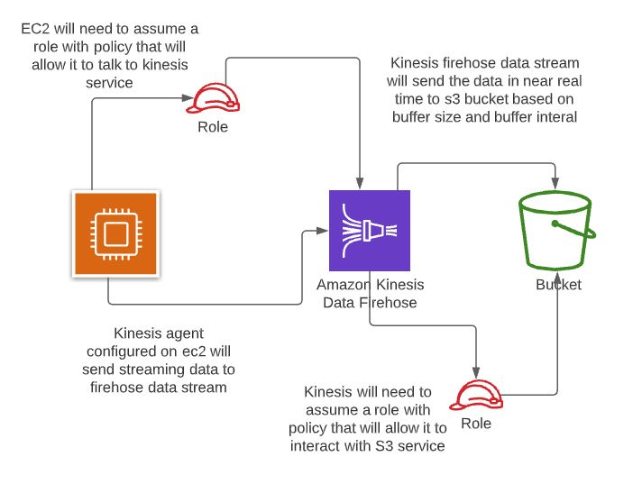

## Architecture


## Check what kinesis agent is doing .
```
tail -f /var/log/aws-kinesis-agent/aws-kinesis-agent.log 
```

## Always make sure that stream data is being stored in a path where kinesis can access it .Using users home folder will cause issues hence created and used below path .
```
/var/log/kinesis_stream_data
```


## Initial code in  /etc/aws-kinesis/agent.json

```
{
  "cloudwatch.emitMetrics": true,
  "kinesis.endpoint": "",
  "firehose.endpoint": "",

  "flows": [
    {
      "filePattern": "/tmp/app.log*",
      "kinesisStream": "yourkinesisstream",
      "partitionKeyOption": "RANDOM"
    },
    {
      "filePattern": "/tmp/app.log*",
      "deliveryStream": "yourdeliverystream"
    }
  ]
}
  ```
  
## Typical role that we attach to firehose for access
```
{
    "Version": "2012-10-17",
    "Statement": [
        {
            "Sid": "",
            "Effect": "Allow",
            "Action": [
                "glue:GetTable",
                "glue:GetTableVersion",
                "glue:GetTableVersions"
            ],
            "Resource": [
                "arn:aws:glue:us-east-1:285062817103:catalog",
                "arn:aws:glue:us-east-1:285062817103:database/%FIREHOSE_POLICY_TEMPLATE_PLACEHOLDER%",
                "arn:aws:glue:us-east-1:285062817103:table/%FIREHOSE_POLICY_TEMPLATE_PLACEHOLDER%/%FIREHOSE_POLICY_TEMPLATE_PLACEHOLDER%"
            ]
        },
        {
            "Sid": "",
            "Effect": "Allow",
            "Action": [
                "s3:AbortMultipartUpload",
                "s3:GetBucketLocation",
                "s3:GetObject",
                "s3:ListBucket",
                "s3:ListBucketMultipartUploads",
                "s3:PutObject"
            ],
            "Resource": [
                "arn:aws:s3:::psb-buckets",
                "arn:aws:s3:::psb-buckets/*"
            ]
        },
        {
            "Sid": "",
            "Effect": "Allow",
            "Action": [
                "lambda:InvokeFunction",
                "lambda:GetFunctionConfiguration"
            ],
            "Resource": "arn:aws:lambda:us-east-1:285062817103:function:%FIREHOSE_POLICY_TEMPLATE_PLACEHOLDER%"
        },
        {
            "Effect": "Allow",
            "Action": [
                "kms:GenerateDataKey",
                "kms:Decrypt"
            ],
            "Resource": [
                "arn:aws:kms:us-east-1:285062817103:key/%FIREHOSE_POLICY_TEMPLATE_PLACEHOLDER%"
            ],
            "Condition": {
                "StringEquals": {
                    "kms:ViaService": "s3.us-east-1.amazonaws.com"
                },
                "StringLike": {
                    "kms:EncryptionContext:aws:s3:arn": [
                        "arn:aws:s3:::%FIREHOSE_POLICY_TEMPLATE_PLACEHOLDER%/*"
                    ]
                }
            }
        },
        {
            "Sid": "",
            "Effect": "Allow",
            "Action": [
                "logs:PutLogEvents"
            ],
            "Resource": [
                "arn:aws:logs:us-east-1:285062817103:log-group:/aws/kinesisfirehose/test:log-stream:*"
            ]
        },
        {
            "Sid": "",
            "Effect": "Allow",
            "Action": [
                "kinesis:DescribeStream",
                "kinesis:GetShardIterator",
                "kinesis:GetRecords",
                "kinesis:ListShards"
            ],
            "Resource": "arn:aws:kinesis:us-east-1:285062817103:stream/%FIREHOSE_POLICY_TEMPLATE_PLACEHOLDER%"
        },
        {
            "Effect": "Allow",
            "Action": [
                "kms:Decrypt"
            ],
            "Resource": [
                "arn:aws:kms:us-east-1:285062817103:key/%FIREHOSE_POLICY_TEMPLATE_PLACEHOLDER%"
            ],
            "Condition": {
                "StringEquals": {
                    "kms:ViaService": "kinesis.us-east-1.amazonaws.com"
                },
                "StringLike": {
                    "kms:EncryptionContext:aws:kinesis:arn": "arn:aws:kinesis:us-east-1:285062817103:stream/%FIREHOSE_POLICY_TEMPLATE_PLACEHOLDER%"
                }
            }
        }
    ]
}

```
